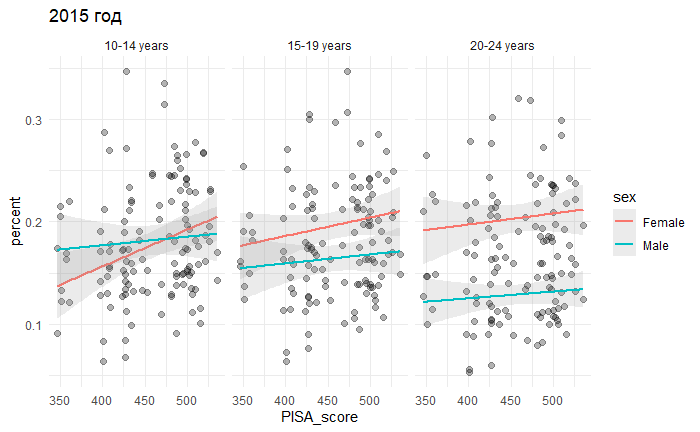
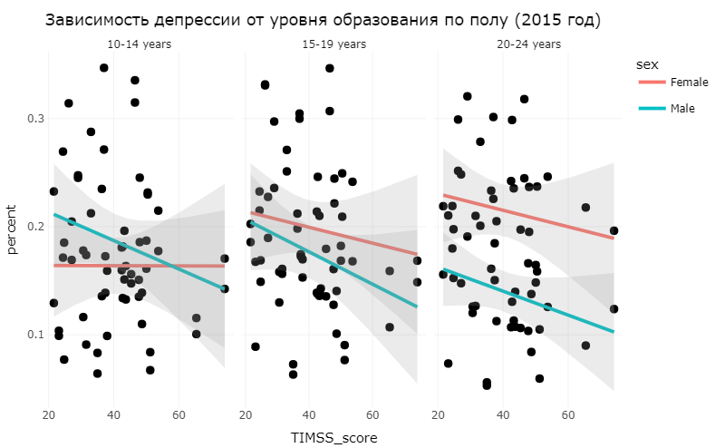
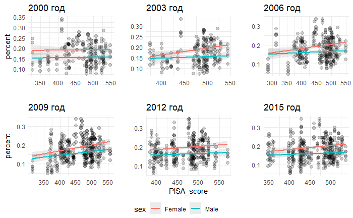

# Association between depressive disorders and various factors in adolescents by country
—

## Motivation

Depression is one of the most common affective spectrum disorders [^1]. The exact causes of depression have not been identified, but it is known that it is influenced by many factors: from genetic predisposition to environmental influences, as well as many socio-economic factors [^2]. Teenagers, due to rapid hormonal adjustment and growth, may be particularly vulnerable to depression [^3]. 

![Depression Rates by Country 2023 [^4]](./Images/Depression Rates by Country 2023.png "Depression Rates by Country 2023 [^4]")

## Aim, tasks and data

**Aim:** To analyze the dependence of the number of adolescent patients suffering from depressive disorders on socio-economic factors in different countries.

**Tasks:**

* Search and data collection
* Exploratory analysis
* Hypotheses based on data
* Data analysis to find causal relationships between data

**Workflow**

1. Literature search
2. Selection of hypotheses
3. Search for open data to study hypotheses
4. Data analysis

**Data**

As the main dataset, we used data that was obtained from the [GBD](https://vizhub.healthdata.org/gbd-results/) open database of the Institute of Health Indicators and Assessment. They provide a quantitative assessment of the impact of the disease on health based on various indicators. 

| Search       |                                                  |
|--------------|--------------------------------------------------|
| GBD Estimate | Risk factor                                      |
| Measure      | DALYs, YLDs                                      |
| Metric       | Number, Percent                                  |
| Risk         | All risk factors                                 |
| Cause        | Depressive disorders                             |
| Location     | All country                                      |
| Age          | 5-9 years, 10-14 years, 15-19 years, 20-24 years |
| Sex          | Male, Female                                     |
| Year         | 2000 - 2019                                      |
Data to hypotheses will be added in the description of hypotheses.

## Methods and Results

### **Hypothesis No. 1.** The relationship of the average level of school education with the level of depression [^5],[^6],[^7]

To test this hypothesis, data from the [PISA](https://www.oecd.org/pisa/) test and the [TIMSS](https://timssandpirls.bc.edu/timss-landing.html) test were used. PISA is the OECD's Programme for International Student Assessment. PISA measures 15-year-olds’ ability to use their reading, mathematics and science knowledge and skills to meet real-life challenges. TIMSS has monitored trends in mathematics and science achievement every four years, at the fourth and eighth grades. 

In both cases, there is a small dependence, which was further checked for correlation between factors.

Also in the case of the PISA test, the trend repeats at the end of almost every test.

### **Hypothesis No. 2.** The relationship between hunger and the incidence of depression in adolescents and young people

### **Hypothesis No. 3.** The relationship of gender differences with the number of patients with depression

## Summary

## Literature
[^1]: Liu Q et al. 2020
[^2]: (Kessler RC et al. 2013, Lee Y et al. 2021
[^3]: **Paus T et al. 2008**
[^4]: https://worldpopulationreview.com/country-rankings/depression-rates-by-country
[^5]: Robert Li Kitts, Stuart J. Goldman, Education and Depression, Child and Adolescent Psychiatric Clinics of North America, Volume 21, Issue 2, 2012,
[^6]: Catherine E. Ross, John Mirowsky, Sex differences in the effect of education on depression: Resource multiplication or resource substitution?, Social Science & Medicine, Volume 63, Issue 5, 2006
[^7]: Shawn Bauldry, Variation in the Protective Effect of Higher Education against Depression Society and Mental Health, 2015, Vol. 5(2) 145–161
